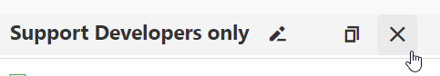

## Overview

The tool contains various metrics to evaluate the main aspects and costs of the support service, individual support engineers and customers. These metrics help evaluate employee performance and predict future support load to effectively allocate support resources across all teams. Experienced support developers rely on these additional metrics daily to validate support activities, reduce incoming support traffic, analyze results from most active users, and track conversions from trial users to licensed users, among many other things.

Metrics are split into the following types (which refer to internal implementation, not grouping in UI): cost, performance, and support.

Data for cost & support metrics is available for the last 5 years.
Data for performance metrics is available for the last 2 years.
With every successful update, we launch a task to remove all data older than 5 (or 2) years ago respectively.

Metrics self-update as follows:

1. Support Metrics - every Sunday (for the last 2 years), Wednesday, Friday at 1 AM (for the last 6 months). The whole process takes about 2 hours. Calculation from scratch for the last 5 years takes about 10-12 hours. This happens because of a relatively complicated algorithm of calculating licenses and their number (we're talking about millions of records). Without license calculations, the rest takes about 20 min.
2. Cost Metrics - on the fourth day of every month (for the whole previous month) by default. Calculation is fast (a few minutes). Calculation from scratch for the last 5 years takes about 30 minutes - 20 of those are needed to get employee data and audit info from employee API.
3. Performance Metrics - every Sunday (for the previous month - i.e., the update date minus 30 days). Calculation is fast (a few minutes). Calculation from scratch takes about 10-20 minutes.

> Sometimes users ask us to delete the entire history of support interaction, and we delete their tickets. At the same time, we delete responses of support engineers as well as replies and feedback in tickets - of both the initial client and other clients in public tickets, if there are any.

> Keep in mind that tents were introduced in April of 2023. Thus, applying tent filters during earlier periods may not reveal objective picture as tents for some employees may be not available.

**Example Scenarios**

[Trial to paid conversion rate](CustomersActivity/4d0662f6c4835a468585fdfa5ffb22a7)

[Specific employees' replies by tents](CustomersActivity/b9211c44965a9360e1cef6d9322bc04c)

[Tickets by platform where a CAT reply type is not set](CustomersActivity/cdf9c0aa6fe9f356697a4bd554382876)

[Which part Blazor traffic takes among all ASP traffic](CustomersActivity/d4391a5073ec0357a4bf65823e275bef)

[Traffic split by platforms (platform popularity)](CustomersActivity/6851f5c4cc773ffb6dbf03d591b30a26)

[Traffic split by support developers, developers, and specific people](CustomersActivity/ea9b2481699455755d03f18ac376ebb4)

[MAU under review traffic gradation](CustomersActivity/e9704cbbeb28cf2f43fc4e9333b2a6a5)

[MAU for Ray traffic gradation](CustomersActivity/3c8bca1140b515cd3b85b5cf197c915e)

[What part of traffic top 5% of Blazor users create among top 50% of Blazor users](CustomersActivity/313b300460b71f4e973bc0bc0117b427)

[Incoming tickets - the export to pdf feature, Reports](CustomersActivity/a723e4828179f26bc1a4512887fef97b)

[How many tickets Ario created in 2022](CustomersActivity/c024bdfc25ef20a670e8e4f7eb010007)

[Licensed user traffic split by tribes](CustomersActivity/a424dcc732255d35a280c32bb486b96a)

## Metric Concepts
### Terms
#### Replies

A reply (post) is any comment or answer an employee leaves in a ticket.

#### Reactivates

Reactivate is any comment or answer a customer leaves in a ticket. Except if last post is a customer post, then we don't consider this iteration as reactivate.

A sequense of *customer's question -> employee's reply -> customer's reply* is not considered to be reactivate as most such one-shot tickets are really resolved from the first try.

Examples:

*Customer's question -> employee's reply -> customer's reply -> employee's reply* contains one reactivate.

*Customer's question -> employee's reply -> customer's reply -> employee's reply -> customer's reply* contains one reactivate as the last customer's reply without an employee's reaction considered to be 'thanks'.

A sequence of more *emplyee's reply -> customer's reply is considered to be reactivate.
Customer's question -> employee's reply -> customer's reply -> employee's reply -> customer's reply -> employee's reply -> customer's reply* contains two reactivates.

#### Iterations

An iteration is a sequence from the customer question (post) to our last answer.

 
**Examples**

* A person created a ticket - we answered - 1 iteration. 
* A person created a ticket - we replied - the person wrote 2 posts in a row - we replied once = 2 iterations.
* A person wrote 1 post, then another person wrote a post - then the first person replied - then a support engineer replied = 1 iteration.
* A person wrote 1 post, then support replied twice in a row = (depending on the post owner, 1 iterations will go to one person if they are the author of both posts, or 1 iteration to each engineer if the post authors are different).

> If a customer writes in another customer's ticket, this is not considered an iteration because:
> 1) The rate of these cases is only 0.7% for the last year.
> 2) In other cases, these are often regular iterations - we continue the dialog, not just leave an answer like "I cloned your request, let's continue in the new ticket".

### Work Hours
#### SC Hours

Hours spent in the SC, i.e., work with support tickets.

#### WF Hours

Hours spent on non proactive activity from Workflow (we imply these hours a person spends on tickets). They may belong to different tents.

#### Work Hours

They are used ony in Cost Metrics and Performance Metrics.
They are calculated as a combination of SC Hours and WF Hours.

1. SC Hours: we take all user tickets (questions, suggestions, bugs) for a period and capture only creations of posts on weekdays (Monday to Friday).

    Each activity has a time mark and an author (employee).
Then, we split all activities into hourly bins of size 1 (for example, from 8 to 9, from 9 to 10, from 11 to 12, etc.).
 Suppose a person closed 2 tickets during the period from 8 AM to 9 AM (1 hour) and from 11 AM to 12 PM (1 hour). Their working hours on that day will be 2 hours.
Since bin size is 1 hour, during this hour, it is possible to close a million tickets, and regardless of the number of activities, we will count it as 1 working hour. Any actions with tickets on weekends (Saturday, Sunday) are NOT taken into account.

2. WF Hours: for the same period, we take working hours from WF (see Metric Concepts -> Terms -> WF Hours).

3. Work Hours: to get the resulting working hours, we combine hours from points 1 and 2 as follows:
    - If WF considers the current day a day off, we always take working hours from (2). These hours are taken from the Work On Holidays field in WF.
    - If the employee was on vacation that day (technically speacking, WF API's (from (2)) ticketsProcessingRanges  = 0 and proactiveHours from (2) = 0), we take 0.
    - If the result from (1) is smaller than (2) _for Support Developers of all levels_, we take (2).
    - In all other cases, we take (1).

#### Paid Hours

When calculating cost metrics, we proceed on the basis that only 168 hours (Paid Hours) are paid per month (8 hours per day * 21 working days minus unpaid leave hours). However, the actual number of working hours (Work Hours) may exceed Paid Hours.

!!! note
    The Ticket Cost metric determines the value by considering the total actual hours spent on tickets, which might include overtime hours. This value is then divided by the total number of tickets answered within the specified time frame of working on the SC tickets.

#### Proactive Hours

In WF, any marked activity (except WorkFromHome, CorporateHousing, WorkOnHolidays, SecondShift, DXMail, OtherTentAssistance) is considered proactive work (different Meetings, Projects, etc.) [1].

No proactive appointment - no proactive work.

If a meeting or any other proactive work goes beyond the scheduled time or ends earlier, we will not be aware of it. WF only knows about what is marked. If a meeting was scheduled for an hour, WF will always return an hour for proactive work regardless of the actual duration. To avoid this, adjust the schedule accordingly (either increase or decrease it).

WF returns the number of proactive hours for the entire day as it aggregates durations of corresponding appointments. Therefore, it doesn't matter when specific proactive work started or ended.

Aggregation of proactive hours in WF works as follows: a day has 8 working hours, anything that doesn't allow you to process tickets (see [1]) is considered proactive work and is subtracted from these 8 hours. The remaining time is considered work with tickets.

On weekends and holidays, WF always returns the value of WorkOnHolidays, which the person specifies for themselves, or 0 otherwise. On these days, proactive hours are always 0.

In general, questions like "what happens if proactive work overlaps with ticket processing" don't make sense because our minimum aggregation unit is a day, not an hour. Within the scope of a day, it doesn't matter. What matters is only aggregation for the day. For instance, on a specific day, a person may have taken half day off, spent three hours on ticket responses, and one hour on proactive work.

### Second Shifts

Days when a person worked second shift.

### Tickets

1. In SupportMetrics, we take into account any user tickets and also bugs and breaking changes created by employees (including SC bots). Right now, replies are collected only for product tickets.
2. In CostMetrics and Performance Metrics, we take into account only tickets of the following types: question, suggestion, bug.

### Forecaster

Strategically, it's an average number of iterations (iterations like in cost metrics, not replies) per hour for a specific person * the number of this person's working hours in a tribe.

Tactically, it's a forecast. I.e., a forecast of the team's cumulative number of iterations for a specific hour - the number of average iterations (for the 4th performance level) * the number of each tribe member's non-working hours for a specific hour.

The advantage of a tactic forecast is that we have a number of tickets that we should address, for example, today. While one person adresses few tickets, others address more tickets (take that person's share). So, in general, the team handles this or does not.

On the other hand, a strategic forecast is a sum of average iterations of every tribe member - it does not care that some people may answer less tickets and others may answer tickets for them. It shows what we can expect from the team if each member _does their best for the given performance level_ (!).

So, the difference between them is that in a strategic forecast, our replies are a more rough estimate, and in a tactic forecast - more exact.

This was the main idea: we estimate the future roughly - somebody will be on vacation, will be ill, or won't work for other reasons. You can estimate different performance levels and see that in a certain period, you can't handle the traffic or can handle it, but with high stress (performance level 4-5 - you just answer tickets and abandon everything else). It's super hard/impossible to work in this mode for more than 1-2 days in a row. So, you can think where to get additional resources for the required period.

With a tactic forecast, in a short term, you can exactly understand whether you will address the traffic with a certain number of people today or tomorrow and plan your work based on this estimate. The number of people is determined by a selector - Support Only, Support & team, etc.

### Support Metrics

All support metrics are calculated from the user's point of view: **how many tickets answered by employees a user created**, how many users asked questions in a certain period. In general, how many actions a person performed in SC. The number of employee replies here is considered a ticket attribute.

This is the purpose of the service. These metrics were not designed to estimate employee performance or calculate costs, although they can be used for this in certain cases. Aggregation is daily.

We take all tickets for the calculation period (see self-updates of metrics in overview). Then, we collect different properties that can be used for filtering from the UI.
We do not collect replies displayed as "no line info" in statistics.

Licenses are only available on downloading Excel. A person's license status is tied to the ticket, not to the individual. If a person had a suitable license when they created the ticket, the person's status for that ticket will be "Licensed," and the license covering the platform(s) or product(s) of the ticket will be visible in Excel. License calculation is described in detail below.

### Cost Metrics

Metrics are calculated from the perspective of the cost of an employee's work hour. Monthly aggregation - we collect all employee replies and aggregate them on a monthly basis (count iterations and the number of unique tickets).

Support developers of any level who are included in the calculation also include Support Chapter Managers and Squad/Tribe Leads with the role of Support Ticket Processing. The Head of Support from the Management Tribe is not included.

The development team includes Developers, Product Managers, Technical Writers, and Chapter/Tribe/Squad Leads who do not have the Support Ticket Processing role. Tribes with development-only support, such as TestCafe and IDE, are also considered part of the development team.

We try to get the primary tribe/tent of a support engineer from audit info. If audit info doesn't contain it, we take the current tribe/tent. If the current one is not specified either, the tribe/tent in which the employee answered the biggest number of tickets for the given period is considered primary.

Members of the Internal tribe are not taken into account in calculations.

### Performance Metrics

Metrics are calculated from the employee's perspective: how many responses the employee posts per hour, etc. Aggregation is daily — we gather all replies for the day and calculate the number of unique tickets based on them.

The calculation concept is similar to the idea of calculating cost metrics — _we select posts, find tickets_ that meet the conditions based on these posts, and then work with these tickets. In support metrics, however, _we select replies from employees for tickets_. This is the difference that affects the number of tickets and replies. So, in general, with identical filters, their quantity in support metrics may differ from cost and performance metrics. Also, like for Support Metrics, we do not collect replies displayed as "no line info" in statistics.

## Metric Algorithms
### Performance Metrics
#### How Work Hours are used

Work Hours are distributed among tents proportionally to the number of replies in each tent and are then used in metrics calculations.

Work Hours (in a tent) = SC Work Hours * (the number of replies in the tent) / (the number of replies in all tents)

### Cost Metrics
#### How SC Work Hours are used

Work Hours are used in some metrics directly and are also used to calculate the Paid SC Hours as (Work Hours + the SC part of paid leave hours) if Paid SC Hours lesser than (Paid Hours - Proactive Hours). Otherwise, Paid SC Hours are (Paid Hours - Proactive Hours).

Calculation of cost metrics is based on Paid Hours, and the actual number of work hours may be bigger than Paid Hours. Paid leave hours (vacation/suck leave) are split into two parts - SC and Proactive - proportionally to the number of hours spent on each activity.

#### How Proactive Hours are used

Proactive Hours are used by some metrics directly (e.g., to calculate proactive costs) and are also used to calculate the Paid SC Hours described in the previous paragraph.

#### Leaves

Vacations and sick leaves are taken from the vacations API.

We do not differentiate between sick leaves, vacations, etc. as we are only interested in costs.

#### Employee Levels

The person's level is taken from audit info. If audit info doesn't have a corresponding record, we take the current level.

If the level of any employees (including Philippine employees, as they recently appeared on Employee Portal) is missing until a certain moment, we calculate their levels approximately according to the formula "time since they were hired / the number of levels till the current level" and approximately determine the time of every promotion, starting from the very first level - Trainee/Junior I.

If the level changed this month (a conflict appears as we have 2 levels in the same month), the new level will be taken next month.

#### Salaries and Taxes

We have a general salary table (EmployeesSalaries). It lists salaries according to levels, positions, locations (Armenia, Cyprus, Philippines, etc.), and periods (there was a significant change in salaries in October 2022). Tax terms for individual entepreneurs are also taken into account.

Salaries in different currencies are converted to USD using the exchange rates EUR/USD = 1, PHP/USD = 0.018. For each employee, we calculate the hourly rate for the period - take the salary corresponding to their level and location from the salary table.

The maximum number of paid hours in a month is limited to 168 hours, which is a standard work month.

If a person resigned but later was hired again, then during the resignation period, they will be absent. In the month of resignation/employment, the number of paid hours for that month will be equal to the number of working hours between the beginning of the month and the resignation/employment date, up to the start of the next month.

The number of paid hours in the month of resignation cannot exceed the number of working days from (the resignation date minus the beginning of the month) x 8 hours.

Calculation nuances:

* Administrative expenses for office rent, equipment, etc., are not taken into account in the wage budget.
* Administrative expenses change over time (approximately once per quarter, or even monthly).
* The wage budget is calculated based on Gross, not NET salaries.
* Holiday payments are calculated according to worked hours (Work On Holidays) from Workflow.
* Officially paid sick leave and vacation days from CRM (see the Leaves section above) are taken into account.

If there are changes in salary or the office location, the DXStatisticsV2.dbo.EmployeesSalaries table should be manually adjusted.

If there is a change in employment status (for example, from an individual entrepreneur to a full-time employee or vice versa), a record needs to be deleted from or added to DXStatisticsV2.dbo.EmployeesSelfEmployed.

#### Validation of cost metric values according to the real wage budget

We accept a deviation from the actual wage fund (Gross) within the range of up to 3% due to the following factors:

* Bonuses, awards, additional payments, compensations are not taken into account as they are hard to track. Examples: operational expenses, business trips, tribe initiatives, unapproved overtime, compensations for unused vacation days upon resignation, childbirth allowances, deductions for unpaid leave, equipment buyouts, loans, and more.
* There are employees who worked part-time (for example, students) - it is impossible to automatically identify them. By default, all individuals are considered full-time employees.
* Some employees have a custom reduced salary that does not match their level, but the calculation is based on standard salary levels.
* There was a time when employees were hired with a higher salary, and later it was reduced. This happened with employees from CIS countries, for example. Calculation is based on the current salary values.

### Support Metrics
#### License Status

During calculation of license statuses, only licenses with associated orders are taken into account. An order can be paid or free, and it determines whether the license is paid or free for the user. For example, a person may have a Universal license, and the ticket's license status may be free, indicating that the client did not pay for this Universal license (regardless of how their license status may appear in SC or CRM, where it may seem paid). Licenses without orders are filtered out (this may happen for historical licenses from a distant past, such as Navigation, Layout & Multi-Purpose Controls Subscription v12.2). If a person only has such historical licenses and has never had any others, calculations will show that they never had any licenses (i.e., the person will have a trial status).

Among all licenses, we choose the most suitable one as follows:

1. We compare products and platforms in the ticket with those in the license; we also compare the ticket creation date with the license subscription's start and expiration dates. Based on this, we obtain the license status. Although we do NOT compare the build in the ticket with the build in the license, new products are not included in old licenses because a license has a basic set of products that changes for all licenses, as well as bundled skus, which come free with the license. Bundled skus are new products included in a specific license, starting from a certain point. Bundled skus can be different for each version of the same license and for each person.
2. We sort matching licenses in ascending order of the license status (see the next paragraph 'License Status...').
3. We take the top one from the resulting list.

In Excel, licenses are documented in 2 columns: most_appropriate_license and parent_license.

most_appropriate_license contains the license that matches products and/or platforms in the ticket. It may be a bundle within another license. In such cases, parent_license will contain the name of the license that includes this bundled license.

If you need to obtain only paid subscriptions, you should use IF(ISBLANK(parent_license), most_appropriate_license,parent_license) in Excel. I.e., prioritize parent_license. If it does not exist, then use most_appropriate_license.

License status is tied to the ticket, not the user, and is determined as follows:

1. Licensed = the ticket creator had a paid license at the time of creation or they are from Barclays.
2. Free = the person had a free license at the time of ticket creation. Free means the order status is 'free,' i.e., the person did not pay, regardless of the type of license - e.g., Xamarin, Universal.
3. Expired = a paid license was expired at the time of creation.
4. Revoked = the ticket was created after the person's license was revoked.
5. Assigned to someone = the person owns a license, but they transferred it to someone else, and it is unavailable to them.
6. No license = among all licenses, none includes the ticket's platforms/products.
7. No license, Free = (6), but there is some free license.
8. No license, Licensed = (6), but there is some paid license.
9. No license, Licensed, Revoked = (6), but there was a paid license that was revoked.
10. No license, Expired = (6), but there is an expired paid license.
11. No license, Expired, Revoked = (6), but there was an expired license that was revoked.
12. No license, Free, Expired = (6), but there is an expired free license.
13. Trial = the person did not have any orders at the time of ticket creation.

If a person has a No license % status, but you do not see suitable licenses in CRM, they were likely upgraded.

Conversion is calculated as follows:

1. If the user had trial tickets for the analyzed period (among tickets falling within this time frame, not among all tickets in general). The length of the period is calculated as (current year) minus (4 years).
2. If there were no trial tickets, conversion is not possible.
3. If there were trial tickets:
    - If there are tickets with a license status = licensed, it is considered converted_paid. (*)
    - If not (*) and if the person has tickets with a license status = free, it is considered converted_free.

## Metrics Overview
### Cost

**Iteration Cost (gross)**

The total cost of processing an individual iteration within any support ticket. This cost includes all relevant taxes and is calculated in USD on a gross basis.

**Proactive Work Cost (gross)**

The total cost of performing proactive work that aims to enhance the public support service and internal support processes and is not directly related to customer support. This cost includes all relevant taxes and is calculated in USD on a gross basis.

> Available to Support Leads only.

**SC Work Cost (gross)**

The overall expense of handling support tickets in the Support Center not exceeding the standard 8-hour workday. This cost includes all relevant taxes and is calculated in USD on a gross basis.

> Available to Support Leads only.

**Support Service Cost (gross)**

The overall expense of the customer support service delivered by our employees, which encompasses all support proactive work efforts. This cost includes all relevant taxes and is calculated in USD on a gross basis.

> Available to Support Leads only.

**Ticket Cost (gross)**

The total cost of processing a single unique support ticket, including all iterations. This cost includes all relevant taxes and is calculated in USD on a gross basis.

**Work Hours Cost (gross)**

The cost of one work hour for a specific employee is determined by their professional level and considers both paid and unpaid leaves, as well as any payments for working on holidays. This cost includes all relevant taxes and is calculated in USD on a gross basis.

> Available to Support Leads only.

### Customers

**Customer Satisfaction Index**

CSI is a key measure of customer satisfaction with a support service. To determine it, we analyze feedback received from customers in the Support Center after they received a response from the support team. Feedback can be categorized as positive, negative, or neutral. The CSI metric graph displays the percentage of positive feedback among all feedback received. This graph provides a visual representation of customer satisfaction levels.

To calculate the CSI, the following steps are taken:

1. Duplicate feedback (several reactions sent within 30 minutes together) is grouped together. This is because users may click the feedback icon multiple times, resulting in duplicate feedback. By grouping them, we can avoid counting duplicates multiple times.

2. Within each time group, the most frequently occurring feedback is selected as the group feedback value. In cases when multiple feedback has the same frequency, the most recent feedback is chosen.

3. Finally, the average value of all groups within the same ticket is calculated and rounded according to the following criteria:

   - Feedback scores ranging from -1 to -0.3 are considered negative and are rounded to -1.

   - Feedback scores ranging from -0.3 to 0.3 are considered neutral and are rounded to 0.

   - Feedback scores ranging from 0.3 to 1 are considered positive and are rounded to 1.

### Employees

**Availability**

The total number of active employees working in the company.

> Available to Support Leads only.

**Level**

The average professional employee level represented as a traditional digital numeric value.

Here are calculation details:

| Regular Levels	| Philippine Levels |
| :---- | :----------- |
| Trainee – 3 | Junior I, Junior II – 3 |
| Junior – 4 | Junior III, Junior IV – 4 |
| Middle – 5 | Middle I, Middle II, Middle III – 5 |
| Senior I – 5.5 | Senior I, Senior II, Senior III – 5.5 |
| Senior II – 6 | |
| Senior III – 6.5 | |
| TechLead – 7 | |
| Principal – 7.5 | |

> Available to Support Leads only.

### Entities

**People**

Showcases the number of customer profiles that align with the chosen criteria in the filters.

**Replies**

Showcases the number of replies that align with the chosen criteria in the filters.

**Tickets**

Showcases the number of tickets that align with the chosen criteria in the filters.

### Performance

**Iterations per Hour**

The average number of iterations per hour is calculated by dividing the total number of iterations by the total number of work hours in the support center.

**Replies per Hour**

The number of replies sent by a support representative per hour, which helps evaluate their workload and performance. A higher number of replies per hour indicates that the support representative handles more requests efficiently, while a lower number may suggest that they are struggling to keep up with the workload.

**Tickets per Hour**

The average number of unique tickets per hour is calculated by dividing the total number of tickets by the total number of work hours in the support center.

### Productivity

**Contribution**

Contribution is equal to the number of replies of selected employees divided by the sum of all replies in the tent group for a selected period. 
Tent group includes all tents satisfying the tents filter.
 
**L1 / L2 Rate**

The ratio between the quantity of tickets processed from L1 and L2 respectively.

**Reactivate Rate**

The ratio of reactivates to all replies.
A lower ticket reactivate rate indicates that the support team successfully addressed the customer's concerns and shared satisfactory solutions, while a higher rate may suggest that improvements are needed in terms of customer service quality.

**Reply Rate**

The average number of reply exchanges between the support team and customers before problem is resolved. I.e., the average number of replies per ticket.

**SC / Proactive work Rate**

The ratio factor represents the number of hours allocated to Support Center work compared to proactive work.

**Work Hours**

See Terms -> Work Hours

**Ticket Lifetime**

For questions, "Ticket Lifetime" is defined as the median amount of time (in hours) between the initial customer inquiry and our final response, encompassing all iterations in between.

For bugs, it is defined as the median duration (in hours) of 'Active For Developers' period after the date the bug was created or converted from question.

Important notes:
- Any other ticket types are disregarded/ignored.
- We only consider tickets that have been closed for over 3 weeks and apply other relevant filters.

**Response Time**

The median duration (in hours) of employee iterations on customer tickets (questions, suggestions, and bugs) and bugs where the Support Team service account is the owner. Only iterations from tickets in the "Active For Support" status are considered, excluding those in the "Closed" and "Active For Developers" statuses.
 
Note that weekend hours are excluded from calculations. Any iteration initiated on a Friday after 3 PM (UTC) and not completed by the end of that Friday or over the weekend will be rescheduled for Monday at 12:00 AM.

**Ticket Resolution Time**

The average time taken (in hours) to communicate a solution to users is calculated based on iterations focused on delivering solutions, excluding those awaiting user responses. This excludes iterations where tickets are marked as Closed and only includes those marked as Active For Support or Active For Developers.

Important notes:

- Tickets managed by Ray are excluded from the calculation.
- Tickets that do not involve user interaction are not considered.
- Tickets with unusually long handling times exceeding 192 hours, such as long-term bugs, are also excluded.
- This metric is specifically targeted at a segment of the complete ticket life cycle. Unlike Ticket Lifetime, it excludes iterations involving Closed ticket statuses where we are waiting for user responses.
- For bugs, it is defined as the duration (in hours) of 'Active For Developers' period after the date the bug was created or converted from question.

### Workflow

**Overtime**

An excess (in hours) of calculated Support Center work hours beyond the standard 8-hour day for the selected period.

**Paid Leave Hours**

The total duration of vacations and/or sick leaves that are fully reimbursed by the company.

> Available to Support Leads only.

**Proactive Work Hours (incl leaves)**

The total number of hours performing proactive work that aims to enhance the public support service and internal support processes and is not directly related to customer support, taking into account paid or unpaid leaves.

**SC Work Hours (incl overtime)**

The Support Center's overall work hours, including the time beyond the standard 8-hour workday.

**Total Work Hours (incl overtime)**

The total amount of time a support developer spends on Support Center tickets and proactive work activities.
Support Center hours are not limited to 168 per month (i.e., include overtime).
In addition, all paid leaves (vacations and sick) are also taken into account respectively.

**Unpaid Leave Hours**

The total duration of vacations, sick leaves, study, or any other non-reimbursed leaves provided by the company.

> Available to Support Leads only.

## UI Reference

### Metrics
To select a metric click into the selector and select a required metric in popup.

Once you get familiar with metrics, you can add required metrics to favorites for faster access.

For this click a metric star in the popup. To remove metric from favorites, click it once again.

If there is at least one favorite metric, a star button is displayed inside the selector. 
Click it to see a dropdown with favorite metrics. This dropdown also always contains the currently selected metric whether it is favorite one or not.

### Filter List Options

#### Period selector

For Support Metrics, it filters based on the ticket creation date (not the reply date).

For Cost Metrics, it specifies the period that includes aggregation periods of one month (the first day of each month for each year within the available range).

For Performance Metrics, it filters based on the reply date (not the ticket creation date).

#### Include / Exclude

The green tick means "select everything that is selected".

The red cross means "select everything except for what is selected".

It's easy to check the result in the pop-up filter (see the image below).

#### Decompose

Decompose values - the ability to decompose by a field or by selected values.

If values are selected, clones of the current set will be created for all of them. Each of these clones will have different values of the decomposed filter.

If nothing is selected, top 20 values will be taken.

### Filters List

The current filter is displayed on hover over the menu button.

Depending on the metric type, you will see different groups of filters.

#### Remove all sets

Allows you to remove all sets at once and start over.

#### Remove set

Allows removing a set.

#### Clone set

Creates a new set with the same setting as the source one.

#### Rename set

You can specify your custome name for a set.

#### Support metrics

**Select Top %**

With Select (skip) Top, you can choose a range of users.

**How is Top formed?**

All tickets that satisfy the specified filters are taken.

Tickets created during the six-month period before the start of the specified period are added to tickets from (1). So, the extended period will look like this: [Six months before the beginning of the selected period, the end of the selected period].

Tickets from (2) are sorted in descending order based on a criterion (either by the number of tickets if the Tickets metric is selected, or by iterations otherwise).

Next, the specified top % is taken from (2) (or the top is skipped, and everything after it is taken).

The intersection of sets 1 and 4 will be the result. For example, we have 5 rows. "Select top 70%" will return all rows where the rank is <= 70%, and "Select skip top" - > 70%.

| row | rank
| 1 | 20%
| 2 | 40%
| 3 | 60%
| 4 | 80%
| 5 | 100%

**Ticket visibility** - allows you to choose ticket visibility (Public или Private). By default, both types are selected.

**Ticket owner** - allows you to choose the ticket owner - customer or employee. By default, both types are selected.

**Ticket closed for** - how many days passed since the closing date (choose any period you're interested in - more than 20 days, 30, etc.).

**Ticket resolution time** - sets the number of full hours during which the ticket was opened.
For questions it is the sum of periods [customer posted an question/answer/comment - we replied] in full hours.
In other words, it is sum of iteration lengths.
For bugs it is the lengh from ticket creation to fixed (or closed without a fix).
Full hours means that if resolution time in minutes equals 50 minutes, in full hours it equals 0 (90 minutes = 1 full hour, 125 minutes = 2 full hours etc).
Also, choose the required metric from existing metrics like Tickets or People.

**Ticket types** -  Question, Bug, DocIssue, etc. from available types.

**Fixed by** - the person who set Fixed. This filter appears if Bug Report is chosen in the Ticket types filter.

**Fixed between** - Tickets that received the Fixed status in the specified period. This filter appears if Bug Report is chosen in the Ticket types filter.

**Severity** - Minor, severe, and other available types. This filter appears if Bug Report is chosen in the Ticket types filter.

**Status** - Closed, active for developers, and other available types. This filter appears if Bug Report is chosen in the Ticket types filter.

**Bugs assigned to** - a list of employees who who have a bug report assigned to them. This filter appears if Bug Report is chosen in the Ticket types filter.

**Bugs closed by** - a list of employees who closed a bug report. This filter appears if Bug Report is chosen in the Ticket types filter.

**Bugs fixed by** - a list of employees who set the Fixed In field in a bug report. This filter appears if Bug Report is chosen in the Ticket types filter.

**Tribes** - the target tribe(s) of a ticket.

**Tents** - the target tent(s) of a ticket.

**Platforms** - the target platform(s) specified for a ticket.

**Products** - the target product(s) specified for a ticket.

**Versions** - the target product version(s) specified for a ticket.

**Ticket Tags** - a set of ticket tags, e.g., KYC and/or MAU tags.

**Duplicated to ticket types** - the type of a ticket (Question, Bug Report, Example, etc.) to which the original ticket is duplicated to.

**Frameworks/Specifics** - the target framework(s) specified for a ticket.

**Operating system** - the target operation system(s) specified for a ticket.

**IDE** - the target IDE(s) specified for a ticket.

**User groups** - MAU and other available types.

**User types** - types of users related to License Status (Licensed and other available types).

**User conversion types** - types of users related to License Status (converted paid and other available types).

**Employee positions** - employee's positions. 

**Employee tribes** - employee's tribes.

**Employee tents** - employee's tents.

**Employee roles** - employee's roles.

**Employees (post owners)** - specific employees.

**CAT replies types** - the target CAT reply type - Simple, Advanced, Workaround, etc.

**CAT components** - the target CAT component or a set of CAT components.

**CAT features** - the target CAT feature or a set of CAT features.

**Customers** - specific customers by their IDs.

#### Cost and Performance metrics

**Teams** - Support, DevTeam (includes all non-support positions like regular devs, technical writers, etc.).

**Tribes** - employee's tribes.

**Tents** - employee's tents.

**Positions** - employee's positions. 

**Employees** - specific employees.

**Second Shifts** - a boolean option that specifies whether to consider second shifts.

### Advanced Settings

#### Disable automatic period extension

by default, the end of a period in the period selector is always the latest available date.
You can switch off this behavior in settings. This option is shared along with the state.

#### Baseline aligned mode

Baseline aligned mode gives us an opportunity to track efficiency of our work with specific user groups.

**Which groups are available**

We have access only to groups that were manually assigned to a user.
This means that it's not possible for all groups to be available to us.
In audit info, there are also many groups that are not interesting, which further narrows the scope.

Currently, from audit info, %MAU% groups are aggressively taken, except for mau candidate groups because they are typically assigned to a user for less than one day, and meaningful analytics cannot be obtained from them.

**How does it work?**

For each user, we select tickets created during the period when the user was in a group (i.e., group_assignment_date <= ticket creation date <= group_removal_date). We use the beginning of the current period as a baseline [1]. After that, for each user in the selected group, we find the date when the user was added to this group [2]. Next, we calculate days_since_baseline = creation date - [2] - [1], which gives us the number of days elapsed from the baseline to the creation of the next ticket.

We also select all users who were not included in the list on the 1st step but meet the selected settings. These can be users who were added to selected groups before the start of the baseline or users whose addition date is not present in audit info. This is possible because a record appears in audit info only if a user was manually added to a group (see "Which groups are available"). For such users, days_since_baseline = creation_date - MAX (the earliest group creation date among all selected groups of the user; the user's registration date). This allows us to see if users get included in the same group several times.

**How is it implemented?**

Instead of dates, the chart shows the ordinal number of the period, which is calculated as days_since_baseline / period, where the period, depending on selected grouping, can be 1, 7, 30, or 365 days. For example, if we choose the Week-Year grouping, period 1 will include everyone who wrote in the first 7 days after being added to the group, period 2 will include everyone who wrote in the [8, 14] day range, etc.

You can enable this mode in Sets' advanced settings.

[Example](CustomersActivity/f9f33402796004f0016032527fdd9138)

P.S. This option is a part of the state, so after you open the link, switch the option off manually. In short, this option is the same as any other, so if it needs to be changed, change it. The only difference is that this option is hidden.

### States

Save State - save the current state (i.e., all current settings).
Drop State - drop a state from the list of available states.
Apply State - apply a state from the list of available states.
 
All states are stored in LocalStorage.

Share State - the ability to share current settings.

Under the hood, it works similarly to url shortener:

On a click, we push the current state to the storage and return stateId.
Then, we copy the CustomersActivity/stateId link to the clipboard (here is an example link: CustomersActivity/6dee962ca7976cd3f555abc172f4fc78).

When the link is opened, we get stateId from url params, get the state from the storage, apply the state, and redirect to CustomersActivity.

States are backed up every 10 min or 10 saves.

### Excel Export

We export raw data (for the chosen period) used to calculate the chosen metric.

The column set may differ - it depends on the data used to calculate the metric.

## Technical Details

Functionality available at  consists of several services: 
- [Frontend](https://github.com/Stanislav-Shchelokovskiy/MetricsUI) 
- Backends: 
   - [Cost metrics](https://github.com/Stanislav-Shchelokovskiy/Cost-Metrics) 
   - [Support metrics](https://github.com/Stanislav-Shchelokovskiy/Support-Metrics) 
   - [Performance metrics](https://github.com/Stanislav-Shchelokovskiy/Performance-Metrics) 
   - [Forecaster](https://github.com/Stanislav-Shchelokovskiy/Forecaster) 
   - [Conversion service](https://github.com/Stanislav-Shchelokovskiy/conversion_service.git) 
- [Proxy](https://github.com/Stanislav-Shchelokovskiy/metrics_proxy.git) 

### Access Groups

The users of the Engineering Metrics application are categorized into three groups: Basic, Advanced, and Admin.

The Basic group is automatically assigned to all employees and has access to a standard set of metrics that are publicly available.

The Advanced group is designated for employees in CM, EM, and PM roles, allowing them to view a broader range of metrics compared to the Basic group.

The Admin group is reserved for Support Top personnel and grants access to less commonly used metrics that are considered more specialized.

Access to these user groups can be managed by the Internal Tribe or any individual with permissions on the [Azure Portal](https://portal.azure.com/).
